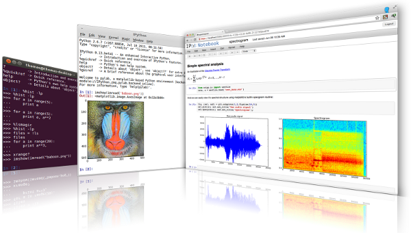
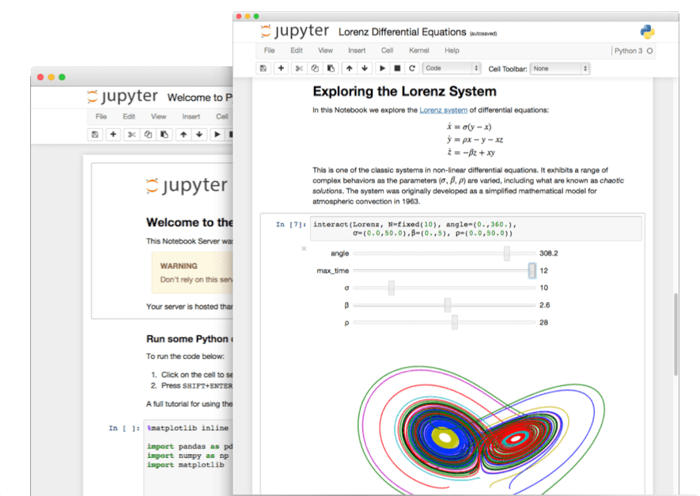
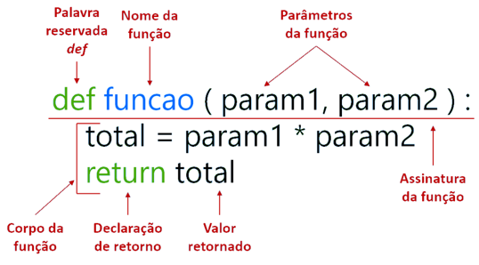

---
# Marp Presentation Configuration
# Use the 'default' theme provided by Marp
# Enable pagination (slide numbers)
# Disable the default Marp pagination style (we use custom footer)
# Set a header common to all slides
# Set a footer common to all slides
marp: true
theme: default
paginate: true
_paginate: false
---

# CCP9040 Introdução à Programação Científica
***Lagntangen, H. P. A Primer on Scientific Programming with Python***

---

# Linguagem e Ambiente
* **Linguagem:** Python 3.x
* **Ambiente:** Jupyter Notebook (Google Colab)
* **Editor:** Google Colab (ou Jupyter Notebook)

---

## Por que Python?
<div style="text-align: center">
    
</div>

---

## Python

* **O que é?** Linguagem de programação de alto nível, versátil e com sintaxe legível.
* **Ecossistema:** Vasta biblioteca padrão + bibliotecas de terceiros (NumPy, Pandas, Matplotlib...).
* **Foco (neste curso):** Ideal para computação científica, análise de dados e automação.


---

## Ferramentas Interativas: IPython

* **O que é?** Um **shell interativo avançado** para Python (melhora o terminal `python`).
* **Recursos Chave:**
    * Autocompletar (Tab)
    * Ajuda (`?`, `??`)
    * Comandos "mágicos" (`%timeit`, `%run`)
    * Melhor visualização.
* **É a base para o Jupyter.**



---

## Ambiente de Desenvolvimento: Jupyter

* **O que é?** Ambiente **web** para criar **Notebooks** (`.ipynb`).
* **Notebooks Combinam:**
    * Código executável (Python, etc.)
    * Texto formatado (Markdown)
    * Visualizações (gráficos)
    * Resultados
* **Uso:** Exploração de dados, prototipagem, relatórios, ensino.



---

## Ambiente na Nuvem: Google Colab

* **O que é?** Versão **gratuita** e **online** do Jupyter Notebook, hospedada pelo Google.
* **Vantagens:**
    * **Sem instalação** necessária.
    * Acesso a **GPUs e TPUs** gratuitas (ótimo para IA/ML).
    * Integração com **Google Drive**.
    * Fácil **compartilhamento** e colaboração.
* **Usaremos bastante!**


---

# Conceitos Básicos
| Conceito    | Descrição                                                                                                                          |
| :---------- | :--------------------------------------------------------------------------------------------------------------------------------------- |
| Código      | Conjunto de instruções escritas em uma linguagem de programação.                                                                         |
| Script      | Arquivo de texto contendo código-fonte (ex: `script.py`).                                                                                |
| Variável    | Espaço na memória com um rótulo, usado para armazenar dados.                                                                             |
| Função      | Bloco de código que executa uma tarefa específica e pode ser reutilizado.                                                                |

---

**Exercise 1.2: Write a Hello World program**
Almost all books about programming languages start with a very simple program that prints the text Hello, World! to the screen. Make such a program in Python. Filename: `hello_world.py`.

---

## O que é um Programa?

Um programa é uma sequência de instruções escritas em uma linguagem de programação (como Python) que dizem ao computador exatamente o que fazer, passo a passo, para realizar uma tarefa específica ou resolver um problema.

### Para que serve?
Programas nos permitem automatizar tarefas, fazer cálculos complexos, criar jogos, analisar dados, e muito mais. O computador apenas segue as instruções que nós escrevemos no programa.


---

**Exercise 1.1: Compute 1+1**
The first exercise concerns some very basic mathematics and program ming: assign the result of 1+1 to a variable and print the value of that variable. Filename: `1plus1.py`.


---

## O que é uma Variável?
Uma variável é um espaço na memória do computador ao qual damos um nome simbólico (uma etiqueta) e que usamos para armazenar um dado (como um número, um texto ou outro tipo de informação).
### Para que serve?
Usamos variáveis para guardar informações que podemos precisar usar ou modificar mais tarde no nosso programa. Em vez de usar o valor diretamente toda vez, usamos o nome da variável. O valor dentro da "caixa" pode mudar durante a execução do programa.


---

## Nomes em Python: Variáveis e Classes (PEP 8)

Escolher bons nomes é crucial para a **legibilidade** e **manutenção** do código!

### Regras Gerais (Obrigatório)

* Nomes devem começar com uma **letra** (a-z, A-Z) ou **underscore** (`_`).
* O restante pode conter letras, números (0-9) e underscores.
* São **Case-Sensitive**: `minha_var` é diferente de `Minha_Var`.
* **Não podem** ser [Palavras Reservadas](https://docs.python.org/3/reference/lexical_analysis.html#keywords) (como `if`, `for`, `while`, `class`, `def`, `import`, `True`, `False`, `None`, etc.).

---

### Convenções (Boas Práticas - PEP 8)

<div style="display: flex; gap: 20px;">
    <div style="flex: 1; border: 1px solid #ddd; border-radius: 10px; padding: 15px;">
        <h4>Variáveis (e Funções): <code>snake_case</code></h4>
        <ul>
            <li>Use <strong>letras minúsculas</strong>.</li>
            <li>Separe palavras com <strong>underscore</strong>.
            <li><strong>Exemplos:</strong>
            <br>
            <code>taxa_juros = 0.05</code></li>
            <code>_variavel_interna = 10</code>
            <code>def calc_media(lista_numeros):</code>
        </ul>
    </div>
    <div style="flex: 1; border: 1px solid #ddd; border-radius: 10px; padding: 15px;">
        <h4>Classes: <code>CapWords</code></h4>
        <ul>
            <li>Comece <strong>cada palavra</strong> com <strong>letra maiúscula</strong>.</li>
            <li><strong>Não</strong> use underscores para separar palavras.</li>
            <li><strong>Exemplos:</strong>
                <ul>
                    <li><code>class Ponto2D:</code></li>
                    <li><code>class SmallTown:</code></li>
                </ul>
            </li>
        </ul>
    </div>
</div>

---

### Por que seguir as convenções?

* **Legibilidade:** Facilita a leitura e compreensão do código por você e por outros.
* **Padrão da Comunidade:** A maioria das bibliotecas Python segue essas convenções.
* **Manutenção:** Código legível é mais fácil de depurar e modificar.

**Em resumo: use `snake_case` para variáveis e funções, e `CapWords` para classes.**

---

# Tipos de Dados Básicos e Literais

Vamos explorar os blocos de construção fundamentais para armazenar dados em Python: números inteiros, números de ponto flutuante e texto.

---

## Literais: Valores Fixos no Código

*   **O que são?** Representações diretas de valores fixos no código-fonte.
*   Quando você escreve `10`, `3.14` ou `"Olá"`, você está usando literais.
*   Python infere o tipo de dado a partir do formato do literal.

---

## Inteiros (`int`)

*   **O que são?** Números inteiros, positivos, negativos ou zero, sem parte decimal.
*   **Uso:** Contagem, indexação, operações matemáticas exatas.

```python
# Declaração usando literais inteiros
ano_nascimento = 1995
quantidade_itens = 10
saldo_devedor = -50
temperatura_zero_absoluto = -273

# Verificando o tipo
print(type(ano_nascimento))
print(type(quantidade_itens))
```

---

## Ponto Flutuante (`float`)

*   **O que são?** Números que possuem uma parte decimal (usam `.`).
*   **Uso:** Medidas, cálculos científicos, valores monetários (com ressalvas*).
*   Podem ser representados em notação científica (`e` ou `E`).

```python
# Declaração usando literais float
preco_produto = 49.99
pi_aproximado = 3.14159
temperatura_media = -5.5
distancia_anos_luz = 4.246e16 # 4.246 * 10^16

# Verificando o tipo
print(type(preco_produto))
print(type(pi_aproximado))
print(type(distancia_anos_luz))
```

---

## Strings (`str`)

*   **O que são?** Sequências de caracteres (letras, números, símbolos) usadas para representar texto.
*   **Delimitadores:** Podem ser declaradas com:
    *   Aspas simples: `'Olá, mundo!'`
    *   Aspas duplas: `"Python é legal"`
    *   Aspas triplas (simples ou duplas): `'''Texto em múltiplas linhas'''` ou `"""Outro texto longo"""`
*   **Uso:** Nomes, mensagens, arquivos de texto, dados categóricos.

---

## Strings (`str`) - Exemplos

```python
# Declaração usando literais string
nome_disciplina = "Introdução à Programação Científica"
mensagem_curta = 'Use Colab!'
paragrafo = """
Este é um exemplo de string
que ocupa várias linhas no código.
É útil para documentação ou textos longos.
"""
codigo_ufc = 'CCP9040'

# Verificando o tipo
print(type(nome_disciplina))
print(type(mensagem_curta))
print(type(paragrafo))
print(type(codigo_ufc)) # Mesmo contendo números, é uma string!
```

---

## Strings (`str`) - F-Strings

*   Uma forma conveniente e legível de formatar strings, incorporando valores de variáveis diretamente.
*   Prefixe a string com `f` ou `F` e coloque as variáveis entre chaves `{}`.

```python
nome_aluno = "Maria"
nota = 9.5
disciplina = "CCP9040"

# Usando f-string
mensagem = f"A aluna {nome_aluno} tirou {nota} na disciplina {disciplina}."
print(mensagem)

# Exemplo com cálculo dentro da f-string
a = 5
b = 3
print(f"A soma de {a} e {b} é {a + b}.")
```
---

---

# Coleções: Sequências e Iteráveis

Além dos tipos básicos, Python oferece estruturas para agrupar múltiplos valores. As **sequências** são coleções ordenadas de itens.

*   **Iterável:** Qualquer objeto que pode ser percorrido item a item (ex: em um laço `for`).
*   Exemplos comuns: Listas, Tuplas, Strings, Range.

---

## Listas (`list`)

*   **O que são?** Coleções **ordenadas** e **mutáveis** (podem ser alteradas após a criação) de itens.
*   **Sintaxe:** Itens separados por vírgula, entre colchetes `[]`.
*   Podem conter itens de tipos diferentes.

```python
# Criando listas
numeros_primos = [2, 3, 5, 7, 11, 13]
tarefas_dia = ["Ler email", "Reunião", "Codificar", "Almoçar"]
lista_mista = [10, "Python", 3.14, True]
lista_vazia = []

print(numeros_primos)
print(type(tarefas_dia))
```

---

## Listas (`list`) - Acesso e Modificação

*   **Acesso por Índice:** Usa colchetes `[]` com o índice (posição) do item. **Índices começam em 0!**
*   **Fatiamento (Slicing):** `lista[inicio:fim:passo]` para obter sublistas.
*   **Modificação:** Atribua um novo valor a um índice `lista[indice] = novo_valor`.
*   **Adicionar:** `.append(item)` adiciona ao final.
*   **Tamanho:** `len(lista)` retorna o número de itens.

---

```python
alunos = ["Ana", "Bruno", "Carlos", "Daniela"]

print(f"Primeiro aluno: {alunos[0]}")      # Saída: Ana
print(f"Último aluno: {alunos[-1]}")       # Saída: Daniela (índice negativo)
print(f"Do segundo ao terceiro: {alunos[1:3]}") # Saída: ['Bruno', 'Carlos']

alunos[1] = "Beatriz" # Modifica o segundo item
print(f"Lista modificada: {alunos}")

alunos.append("Eduardo") # Adiciona ao final
print(f"Lista com adição: {alunos}")
print(f"Número de alunos: {len(alunos)}")
```

---

## Tuplas (`tuple`)

*   **O que são?** Coleções **ordenadas** e **imutáveis** (não podem ser alteradas após a criação) de itens.
*   **Sintaxe:** Itens separados por vírgula, geralmente entre parênteses `()`.
*   Os parênteses são opcionais em muitos casos, mas recomendados para clareza.

```python
# Criando tuplas
coordenadas_ponto = (10.5, -3.2)
cores_rgb = (255, 0, 128)
data_importante = (25, 12, 2023)
tupla_um_item = (99,) # Vírgula é crucial para tupla de um item!
tupla_vazia = ()

print(coordenadas_ponto)
print(type(cores_rgb))
```

---

## Tuplas (`tuple`) - Uso e Imutabilidade

*   **Acesso:** Igual às listas (índices `[]`, fatiamento `[:]`).
*   **Imutabilidade:** **Não se pode** adicionar, remover ou alterar itens após a criação. Tentar fazer isso gera um erro (`TypeError`).
*   **Uso:**
    *   Quando você quer garantir que os dados não mudem (constantes).
    *   Retornar múltiplos valores de uma função.
    *   Chaves de dicionários (veremos a seguir).

---

```python
configs = ("localhost", 8080, True)

print(f"Host: {configs[0]}")
# configs[1] = 9000 # Isso geraria um TypeError!

# Desempacotamento de tupla
host, porta, ativo = configs
print(f"Porta: {porta}, Ativo: {ativo}")
```

---

## Iteráveis e o Laço `for`

Listas, tuplas e strings são exemplos de **iteráveis**. O laço `for` é a forma mais comum de percorrer os itens de um iterável.

```python
nomes = ["Alice", "Bob", "Charlie"]
for nome in nomes:
    print(f"Olá, {nome}!")

palavra = "UFC"
for letra in palavra:
    print(letra.upper())

# range() também cria um iterável
for i in range(3): # Gera 0, 1, 2
    print(f"Número: {i}")
```

---

# Coleções: Dicionários (`dict`)

*   **O que são?** Coleções **não ordenadas** (antes do Python 3.7) ou **ordenadas** (Python 3.7+) de pares **chave-valor**. São **mutáveis**.
*   **Chave:** Identificador único (e imutável, como string, número, tupla) para acessar um valor.
*   **Valor:** O dado associado à chave (pode ser de qualquer tipo, inclusive outra lista ou dicionário).
*   **Sintaxe:** Pares `chave: valor` separados por vírgula, entre chaves `{}`.

---

## Dicionários (`dict`) - Criação e Acesso

```python
# Criando dicionários
aluno = {
    "nome": "Carlos Silva",
    "matricula": "202300123",
    "curso": "Ciência da Computação",
    "notas": [8.5, 9.0, 7.8]
}

configuracoes = {"host": "api.example.com", "porta": 443, "ativo": True}
dicionario_vazio = {}

# Acessando valores pela chave
print(f"Nome do aluno: {aluno['nome']}")
print(f"Porta da configuração: {configuracoes['porta']}")

# Usando o método .get() (evita erro se a chave não existir)
email = aluno.get("email", "Email não cadastrado") # Valor padrão opcional
print(f"Email: {email}")
```

---

## Dicionários (`dict`) - Modificação e Remoção

*   **Adicionar/Atualizar:** Atribua um valor a uma chave `dicionario[chave] = valor`. Se a chave existe, atualiza; se não, cria.
*   **Remover:**
    *   `del dicionario[chave]`: Remove o par chave-valor. Gera erro se a chave não existe.
    *   `dicionario.pop(chave)`: Remove e *retorna* o valor associado à chave. Gera erro se a chave não existe (a menos que um valor padrão seja fornecido).

---

```python
contatos = {"Ana": "1234-5678", "Bruno": "9876-5432"}

# Adicionando novo contato
contatos["Carla"] = "5555-1111"
print(f"Contatos atualizados: {contatos}")

# Atualizando contato existente
contatos["Ana"] = "1111-2222"
print(f"Ana atualizada: {contatos}")

# Removendo Bruno
telefone_bruno = contatos.pop("Bruno")
print(f"Removeu Bruno ({telefone_bruno}). Contatos: {contatos}")

# Removendo Carla com del
del contatos["Carla"]
print(f"Removeu Carla. Contatos finais: {contatos}")
```

---

## Dicionários (`dict`) - Iteração e Métodos

É comum iterar sobre as chaves, valores ou ambos.

*   `d.keys()`: Retorna uma visão das chaves.
*   `d.values()`: Retorna uma visão dos valores.
*   `d.items()`: Retorna uma visão dos pares (chave, valor).

---

```python
notas_fiscais = {"NF001": 150.00, "NF002": 89.90, "NF003": 210.50}

print("--- Chaves ---")
for chave in notas_fiscais.keys():
    print(chave)

print("\n--- Valores ---")
for valor in notas_fiscais.values():
    print(f"R$ {valor:.2f}")

print("\n--- Itens (Chave e Valor) ---")
for nf, total in notas_fiscais.items():
    print(f"Nota {nf}: R$ {total:.2f}")

# Iterar diretamente sobre o dicionário itera sobre as chaves
print("\n--- Iteração Direta (Chaves) ---")
for k in notas_fiscais:
    print(k)
```

---

## O que é uma Função?

<div style="display: flex; gap: 20px;">
<div style="flex: 1; border: 0px solid #ddd; border-radius: 10px; padding: 15px;font-size: 24px;">
        
* Um **bloco de código nomeado** que realiza uma tarefa específica.
* **Reutilizável:** Pode ser chamado (executado) várias vezes de diferentes partes do programa.
* **Organização:** Ajuda a dividir o código em partes menores e mais gerenciáveis.
* **Abstração:** Esconde os detalhes da implementação, focando no *o quê* a função faz, não no *como*.
        
</div>
<div style="flex: 1; border: 0px solid #ddd; border-radius: 10px; padding: 15px;font-size: 24px;">

```python        
def saudacao(nome):
    """Esta função imprime uma saudação."""
    mensagem = f"Olá, {nome}!"
    print(mensagem)
```	

```python
def somar(a, b):
    """Esta função retorna a 
    soma de dois números."""
    resultado = a + b
    return resultado            
```

```python
def soma_e_diferenca(a, b):
    """Esta função retorna dois 
    valores: a soma e a diferença."""
    soma = a + b
    diferenca = a - b
    return soma, diferenca
```
    
</div>

---

## Declaração de Função

- Use a palavra-chave `def`, seguida pelo nome da função, parênteses `()` e dois pontos `:`.
- O corpo da função (código a ser executado) deve ser indentado.
- Pode receber **parâmetros** (entradas) dentro dos parênteses.
- Pode **retornar** valores usando a palavra-chave `return`.
        


---

## Chamando uma Função

* Para executar uma função, use seu nome seguido por parênteses `()`.
* Se a função espera parâmetros, forneça os **argumentos** dentro dos parênteses.
* Se a função retorna um valor, você pode armazená-lo em uma variável.

```python
# Chamando a função saudacao
saudacao("Aluno")
saudacao("Professor")

# Chamando a função somar e armazenando o resultado
resultado_soma = somar(5, 3)
print(f"O resultado da soma é: {resultado_soma}")

# Chamando e usando o retorno diretamente
print(f"Outra soma: {soma_e_diferença(10, -2)}")
```

---

---

**Exercise 1.3: Derive and compute a formula**
Can a newborn baby in Norway expect to live for one billion ($10^9$) seconds? Write a Python program for doing arithmetics to answer the question. Filename: `seconds2years.py`.

---

**Exercise 1.6: Compute the growth of money in a bank**
Let $p$ be a bank's interest rate in percent per year. An initial amount $A$ has then grown to
$$A\left(\frac{1+p}{100}\right)^n$$
after $n$ years. Make a program for computing how much money 1000 euros have grown to after three years with 5 percent interest rate. Filename: `interest_rate.py`.

---

**Exercise 1.8: Type in program text**
Type the following program in your editor and execute it. If your program does not work, check that you have copied the code correctly.

<div style="font-size: 24px;">

```python
from math import pi

h = 5.0 # height
b = 2.0 # base
r = 1.5 # radius

area_parallelogram = h*b # area of a parallelogram
print('The area of the parallelogram is %.3f' % area_parallelogram)
area_square = b**2 # area of a square
print('The area of the square is %g' % area_square)
area_circle = pi*r**2 # area of a circle
print('The area of the circle is %.3f' % area_circle)
volume_cone = 1.0/3*pi*r**2*h # volume of a cone
print('The volume of the cone is %.3f' % volume_cone)

```

</div>

Filename: `formulas_shapes.py`.

---

**Exercise 1.9: Type in programs and debug them**
Type these short programs in your editor and execute them. When they do not work, identify and correct the erroneous statements.

---

1. Does $sin^2(x) + cos^2(x) = 1$?
```python
# Define the angle
x = pi/4

# Calculate sin^2(x) + cos^2(x)
1_VAL = sin(x)^2 + cos(x)^2

# Print the result
print(1_val)
```

---

2. Compute `d` in meters when
$d = v_0t+0.5at^2$, with $v_0 = 3 m/s$, $t = 1s$, $a = 2 m/s^2$.

<br>

```python
v0 = 3 m/s
t = 1   s
a = 2   m/s**2

# Calculate distance using the formula
d = v0.t + 0.5.a.t^2

print(d) # Should print 4.0
```

---

3. Verify these equations:
$$(a +b)^2 = a^2 +2ab+b^2$$
$$(a −b)^2 = a^2 −2ab+b^2$$
```python
a = 3,3     # Define variables a and b
b = 5,3
a2 = a**2 # Pre-calculate squares
b2 = b**2
eq1_sum = a2 + 2ab + b2 # Calculate the expanded forms
eq2_sum = a2 - 2ab + b2
eq1_pow = (a + b)**2    # Calculate the squared forms
eq2_pow = (a - b)**2
print(f'1st equation: {eq1_sum} = {eq1_pow}')
print(f'2nd equation: {eq2_sum} = {eq2_pow}')
```
Filename:`exercises_debug.py`.

---

**Exercise 3.1: Write a Fahrenheit-Celsius conversion function**  
The formula for converting Fahrenheit degrees to Celsius is given by:  
$$C = \frac{5}{9} (F - 32)$$  

Write a function `C(F)` that implements this formula.  

**Hint:** Do not test `C(F(c)) == c` exactly, but use a tolerance for the difference.  

Filename: `f2c.py`.

---

**Exercise 3.3: Write a function for solving quadratic equations**  
Given a quadratic equation $ax^2 + bx + c = 0$, write a function `roots(a, b, c)` that returns the two roots of the equation.  

- The returned roots should be `float` objects when the roots are real.  
- If the roots are complex, the function should return `complex` objects.  

Filename: `quadratic_roots.py`.

---

**Exercise 3.10: Simulate a program by hand**  
Simulate the following program by hand to explain what is printed:  

```python
def a(x):
    q = 2
    x = 3 * x
    return q + x

def b(x):
    global q
    q += x
    return q + x

q = 0
x = 3
print(a(x), b(x), a(x), b(x))
```

---

**Exercise: Fibonacci numbers**
Write a function `fibonacci(n)` that returns the Fibonacci number of order `n`. The Fibonacci numbers are defined as follows:
$$F_0 = 0, F_1 = 1, F_n = F_{n-1} + F_{n-2} \text{ for } n \geq 2$$
The Fibonacci numbers are: 0, 1, 1, 2, 3, 5, 8, 13, 21, 34, ...
Filename: `fibonacci.py`.

---

## Escopo de Variáveis

* **Escopo Local:** Variáveis criadas *dentro* de uma função só existem *dentro* dessa função. Elas são destruídas quando a função termina.
* **Escopo Global:** Variáveis criadas *fora* de qualquer função são globais e podem ser acessadas (lidas) de qualquer lugar do script, inclusive dentro de funções.
* Para *modificar* uma variável global dentro de uma função, use a palavra-chave `global`. (Geralmente evitado, prefira passar como parâmetro e retornar).

---

<div style="display: flex; gap: 20px;">
<div style="flex: 1; border: 0px solid #ddd; border-radius: 10px; padding: 15px;">

```python
a_global = 100 # Escopo Global

def func1(b):
    a_local = 10 # Escopo Local
    print(f"a_local: {a_local}")
    print(f"b: {b}")
    print(f"a_global: {a_global}")
    a_global = 200
    print(f"a_global: {a_global}")

b = 5
print(f"func_1{func_1(b)}")
print(f"a_global: {a_global}")
```

</div>
<div style="flex: 1; border: 0px solid #ddd; border-radius: 10px; padding: 15px;">

```python
a_global = 100 # Escopo Global

def func1(b):
    global a_global
    a_local = 10 # Escopo Local
    print(f"a_local: {a_local}")
    print(f"b: {b}")
    print(f"a_global: {a_global}")
    a_global = 200
    print(f"a_global: {a_global}")

b = 5
print(f"func_1{func_1(b)}")
print(f"a_global: {a_global}")
```
    
</div>
</div>

---

# Controle de Fluxo

Como fazer o programa tomar decisões e repetir tarefas.

---

## Controle de Fluxo: O Que É?

*   É a ordem em que as instruções de um programa são executadas.
*   Por padrão, a execução é **sequencial** (uma instrução após a outra).
*   Estruturas de controle de fluxo permitem **alterar** essa ordem:
    *   **Execução Condicional:** Executar blocos de código apenas se certas condições forem verdadeiras (`if`, `elif`, `else`).
    *   **Repetição (Loops):** Executar blocos de código múltiplas vezes (`for`, `while`).

---

## Condicional: `if`, `elif`, `else`

*   Permite que o programa escolha qual caminho seguir com base em condições (expressões que resultam em `True` ou `False`).

```python
# Sintaxe
if condicao1:
    # Bloco executado se condicao1 for True
    print("Condição 1 é verdadeira")
elif condicao2:
    # Bloco executado se condicao1 for False e condicao2 for True
    print("Condição 1 é falsa, mas Condição 2 é verdadeira")
else:
    # Bloco executado se todas as condições anteriores forem False
    print("Nenhuma das condições anteriores é verdadeira")
```
*   A indentação (espaços no início da linha) é **crucial** para definir os blocos!
*   `elif` (else if) e `else` são opcionais.

---

## Condicional: Exemplo

<div style="display: flex; gap: 20px;">
<div style="flex: 1; border: 1px solid #ddd; border-radius: 10px; padding: 15px;">

```python	
temperatura = 25

if temperatura > 30:
    print("Está muito quente!")
elif temperatura > 20:
    print("Temperatura agradável.")
elif temperatura < 10:
    print("Está frio!")
else:
    print("Temperatura amena.")
```
</div>
<div style="flex: 1; border: 1px solid #ddd; border-radius: 10px; padding: 15px;">

```python
# Exemplo com verificação de número
numero = -5
if numero > 0:
    print(f"{numero} é positivo.")
elif numero == 0:
    print(f"{numero} é zero.")
else:
    print(f"{numero} é negativo.")
```

</div>


---

## Repetição: Laço `for`

*   Usado para **iterar** sobre os itens de uma sequência (como uma lista, uma string, um range) ou qualquer objeto iterável.
*   Executa o bloco de código indentado uma vez para cada item na sequência.

```python
# Sintaxe
for variavel_item in sequencia:
    # Bloco de código executado para cada item
    print(f"Processando item: {variavel_item}")

print("Loop 'for' concluído.")
```

---

## Laço `for` - Exemplos

```python
# Iterando sobre uma lista de números
numeros = [1, 2, 3, 4, 5]
soma = 0
for n in numeros:
    soma = soma + n
    print(f"Item atual: {n}, Soma parcial: {soma}")
print(f"Soma total: {soma}")

# Iterando sobre uma string
palavra = "Python"
for letra in palavra:
    print(letra)

# Usando range() para gerar uma sequência de números
# range(1, 6) -> 1, 2, 3, 4, 5
# range(0, 10, 2) -> 0, 2, 4, 6, 8
for i in range(5):
    print(f"Contagem: {i}")
```

---

## Repetição: Laço `while`

*   Executa um bloco de código **enquanto** uma condição especificada for `True`.
*   A condição é verificada *antes* de cada iteração.

```python
# Sintaxe
while condicao:
    # Bloco de código executado enquanto condicao for True
    print("Dentro do loop while...")
    # É crucial que algo dentro do loop eventualmente
    # faça a condição se tornar False, para evitar loop infinito!

print("Loop 'while' concluído.")
```

---

## Laço `while` - Exemplo

```python
contador = 0
limite = 5

print("Iniciando contagem com while:")
while contador < limite:
    print(f"Contador atual: {contador}")
    contador = contador + 1 # IMPORTANTE: Atualizar a variável da condição

print(f"Contagem finalizada. Contador = {contador}")

```
**Cuidado:** Loops `while` podem facilmente se tornar infinitos se a condição nunca se tornar `False`.

---

## Alterando o Fluxo dos Loops: `break` e `continue`

*   `break`: Interrompe **imediatamente** a execução do loop (`for` ou `while`) mais interno em que se encontra. O programa continua após o bloco do loop.
*   `continue`: Pula o restante do código *dentro* da iteração atual do loop e passa para a **próxima iteração**.

---

## `break` e `continue` - Exemplos

```python
print("Exemplo com break:")
for i in range(10): # 0 a 9
    if i == 5:
        print("Encontrei o 5, saindo do loop!")
        break # Interrompe o loop for
    print(f"Processando {i}")
print("Após o loop com break.\n")

print("Exemplo com continue:")
for i in range(10): # 0 a 9
    if i % 2 == 0: # Se i for par
        continue # Pula para a próxima iteração, ignora o print abaixo
    print(f"Número ímpar encontrado: {i}")
print("Após o loop com continue.")
```

---

**Exercise 3.2: Evaluate a sum and write a test function**
a) Write a Python function `sum_1k(M)` that returns the sum $s = \sum_{k=1}^{M} \frac{1}{k}$.
b) Compute $s$ for $M = 3$ by hand and write another function `test_sum_1k()` that calls `sum_1k(M)` with $M = 3$ and checks that the result is correct.

---

**Exercise: Find the `n` first prime numbers**
Write a function `is_prime(n)` that returns `True` if `n` is prime and `False` otherwise. Write another function `first_n_primes(n)` that returns the first `n` prime numbers.