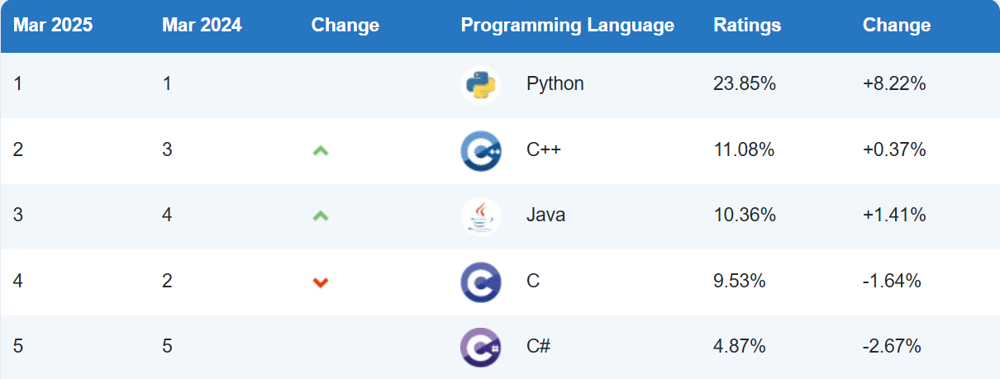
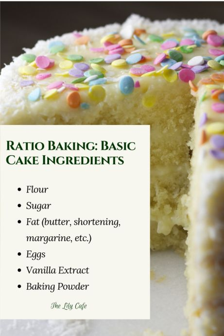

# CCP9040 Introdução à Programação Científica
***Lagntangen, H. P. A Primer on Scientific Programming with Python***

---

## Por que Python?

<div style="text-align: center">
    
</div>

---

**Exercise 1.2: Write a Hello World program**
Almost all books about programming languages start with a very simple program that prints the text Hello, World! to the screen. Make such a program in Python. Filename: `hello_world.py`.

---

## O que é um Programa?

Um programa é uma sequência de instruções escritas em uma linguagem de programação (como Python) que dizem ao computador exatamente o que fazer, passo a passo, para realizar uma tarefa específica ou resolver um problema.

### Para que serve? 
Programas nos permitem automatizar tarefas, fazer cálculos complexos, criar jogos, analisar dados, e muito mais. O computador apenas segue as instruções que nós escrevemos no programa.



---

**Exercise 1.1: Compute 1+1**
The first exercise concerns some very basic mathematics and program ming: assign the result of 1+1 to a variable and print the value of that variable. Filename: `1plus1.py`.


---

## O que é uma Variável?
Uma variável é um espaço na memória do computador ao qual damos um nome simbólico (uma etiqueta) e que usamos para armazenar um dado (como um número, um texto ou outro tipo de informação). 
### Para que serve? 
Usamos variáveis para guardar informações que podemos precisar usar ou modificar mais tarde no nosso programa. Em vez de usar o valor diretamente toda vez, usamos o nome da variável. O valor dentro da "caixa" pode mudar durante a execução do programa.


---

**Exercise 1.3: Derive and compute a formula**
Can a newborn baby in Norway expect to live for one billion ($10^9$) seconds? Write a Python program for doing  arithmetics to answer the question. Filename: `seconds2years.py`.

--- 

**Exercise 1.6: Compute the growth of money in a bank**
Let $p$ be a bank's interest rate in percent per year. An initial amount $A$ has then grown to
$$A\left(\frac{1+p}{100}\right)^n$$
after $n$ years. Make a program for computing how much money 1000 euros have grown to after three years with 5 percent interest rate. Filename: `interest_rate.py`.

---

**Exercise 1.8: Type in program text**
Type the following program in your editor and execute it. If your program does not work, check that you have copied the code correctly.

```python
 from math import pi
 h = 5.0 # height
 b = 2.0 # base
 r = 1.5 # radius
 area_parallelogram = h*b
 print('The area of the parallelogram is %.3f' % area_parallelogram)
 area_square = b**2
 print('The area of the square is %g' % area_square)
 area_circle = pi*r**2
 print('The area of the circle is %.3f' % area_circle)
 volume_cone = 1.0/3*pi*r**2*h
 print('The volume of the cone is %.3f' % volume_cone)
```
 Filename: `formulas_shapes.py`.

 --- 

**Exercise 1.9: Type in programs and debug them**
Type these short programs in your editor and execute them. When they do not work, identify and correct the erroneous statements.
1. Does $sin^2(x) + cos^2(x) = 1$?
```python	
 from math import sin, cos
 x = pi/4
 1_val = math.sin^2(x) + math.cos^2(x)
 print(1_VAL)
```

---

2. Compute `d` in meters when 
$d = v_0t+0.5at^2$, with $v_0 = 3 m/s$, $t = 1s$, $a = 2 m/s^2$.

 ```python
 v0 = 3 m/s
 t = 1 s
 a = 2 m/s**2
 d = v0.t + 0.5.a.t**2
 print(d)
```

---

3. Verify these equations:
 $$(a +b)^2 = a^2 +2ab+b^2$$
 $$(a −b)^2 = a^2 −2ab+b^2$$
```python
 a = 3,3 b = 5,3
 a2 = a**2
 b2 = b**2
 eq1_sum = a2 + 2ab + b2
 eq2_sum = a2- 2ab + b2
 eq1_pow = (a + b)**2
 eq2_pow = (a- b)**2
 print('Firstequation: %g=%g',%(eq1_sum,eq1_pow))
 print('Secondequation: %h=%h',%(eq2_pow,eq2_pow))
```
Filename:`sin2_plus_cos2.py`.