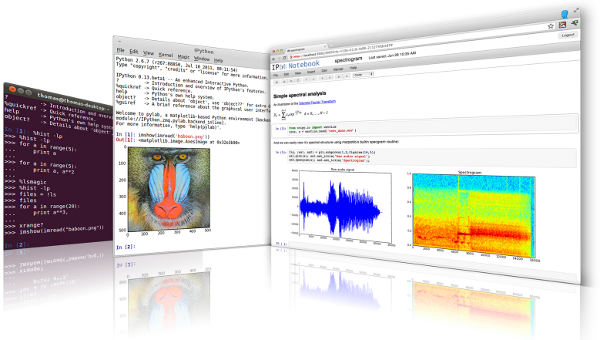

---
# Marp Presentation Configuration
# Use the 'default' theme provided by Marp
# Enable pagination (slide numbers)
# Disable the default Marp pagination style (we use custom footer)
# Set a header common to all slides
# Set a footer common to all slides
marp: true
theme: default
paginate: true
_paginate: false
header: '**CCP9040** - Aula 1'
footer: 'Aula 01: Introdução à Programação Científica'
---

# CCP9040 Introdução à Programação Científica
***Lagntangen, H. P. A Primer on Scientific Programming with Python***

---

# Linguagem e Ambiente
* **Linguagem:** Python 3.x
* **Ambiente:** Jupyter Notebook (Google Colab)
* **Editor:** Google Colab (ou Jupyter Notebook)

---

## Por que Python?
<div style="text-align: center">
    
</div>

---

## Python

* **O que é?** Linguagem de programação de alto nível, versátil e com sintaxe legível.
* **Ecossistema:** Vasta biblioteca padrão + bibliotecas de terceiros (NumPy, Pandas, Matplotlib...).
* **Foco (neste curso):** Ideal para computação científica, análise de dados e automação.


---

## Ferramentas Interativas: IPython

* **O que é?** Um **shell interativo avançado** para Python (melhora o terminal `python`).
* **Recursos Chave:**
    * Autocompletar (Tab)
    * Ajuda (`?`, `??`)
    * Comandos "mágicos" (`%timeit`, `%run`)
    * Melhor visualização.
* **É a base para o Jupyter.**



---

## Ambiente de Desenvolvimento: Jupyter

* **O que é?** Ambiente **web** para criar **Notebooks** (`.ipynb`).
* **Notebooks Combinam:**
    * Código executável (Python, etc.)
    * Texto formatado (Markdown)
    * Visualizações (gráficos)
    * Resultados
* **Uso:** Exploração de dados, prototipagem, relatórios, ensino.


---

## Ambiente na Nuvem: Google Colab

* **O que é?** Versão **gratuita** e **online** do Jupyter Notebook, hospedada pelo Google.
* **Vantagens:**
    * **Sem instalação** necessária.
    * Acesso a **GPUs e TPUs** gratuitas (ótimo para IA/ML).
    * Integração com **Google Drive**.
    * Fácil **compartilhamento** e colaboração.
* **Usaremos bastante!**


---

# Conceitos Básicos
| Conceito    | Descrição                                                                                                                          |
| :---------- | :--------------------------------------------------------------------------------------------------------------------------------------- |
| Código      | Conjunto de instruções escritas em uma linguagem de programação.                                                                         |
| Script      | Arquivo de texto contendo código-fonte (ex: `script.py`).                                                                                |
| Variável    | Espaço na memória com um rótulo, usado para armazenar dados.                                                                             |
| Função      | Bloco de código que executa uma tarefa específica e pode ser reutilizado.                                                                |
| Classe      | Estrutura que define um tipo de dado, encapsulando dados e comportamentos.                                                               |
| Módulo      | Arquivo Python que contém definições de funções, classes e variáveis, podendo ser importado em outros scripts. |

---

**Exercise 1.2: Write a Hello World program**
Almost all books about programming languages start with a very simple program that prints the text Hello, World! to the screen. Make such a program in Python. Filename: `hello_world.py`.

---

## O que é um Programa?

Um programa é uma sequência de instruções escritas em uma linguagem de programação (como Python) que dizem ao computador exatamente o que fazer, passo a passo, para realizar uma tarefa específica ou resolver um problema.

### Para que serve?
Programas nos permitem automatizar tarefas, fazer cálculos complexos, criar jogos, analisar dados, e muito mais. O computador apenas segue as instruções que nós escrevemos no programa.


---

**Exercise 1.1: Compute 1+1**
The first exercise concerns some very basic mathematics and program ming: assign the result of 1+1 to a variable and print the value of that variable. Filename: `1plus1.py`.


---

## O que é uma Variável?
Uma variável é um espaço na memória do computador ao qual damos um nome simbólico (uma etiqueta) e que usamos para armazenar um dado (como um número, um texto ou outro tipo de informação).
### Para que serve?
Usamos variáveis para guardar informações que podemos precisar usar ou modificar mais tarde no nosso programa. Em vez de usar o valor diretamente toda vez, usamos o nome da variável. O valor dentro da "caixa" pode mudar durante a execução do programa.


---

## Nomes em Python: Variáveis e Classes (PEP 8)

Escolher bons nomes é crucial para a **legibilidade** e **manutenção** do código!

### Regras Gerais (Obrigatório)

* Nomes devem começar com uma **letra** (a-z, A-Z) ou **underscore** (`_`).
* O restante pode conter letras, números (0-9) e underscores.
* São **Case-Sensitive**: `minha_var` é diferente de `Minha_Var`.
* **Não podem** ser [Palavras Reservadas](https://docs.python.org/3/reference/lexical_analysis.html#keywords) (como `if`, `for`, `while`, `class`, `def`, `import`, `True`, `False`, `None`, etc.).

---

### Convenções (Boas Práticas - PEP 8)

<div style="display: flex; gap: 20px;">
    <div style="flex: 1; border: 1px solid #ddd; border-radius: 10px; padding: 15px;">
        <h4>Variáveis (e Funções): <code>snake_case</code></h4>
        <ul>
            <li>Use <strong>letras minúsculas</strong>.</li>
            <li>Separe palavras com <strong>underscore</strong>.
            <li><strong>Exemplos:</strong>
            <br>
            <code>taxa_juros = 0.05</code></li>
            <code>_variavel_interna = 10</code>
            <code>def calc_media(lista_numeros):</code>
        </ul>
    </div>
    <div style="flex: 1; border: 1px solid #ddd; border-radius: 10px; padding: 15px;">
        <h4>Classes: <code>CapWords</code></h4>
        <ul>
            <li>Comece <strong>cada palavra</strong> com <strong>letra maiúscula</strong>.</li>
            <li><strong>Não</strong> use underscores para separar palavras.</li>
            <li><strong>Exemplos:</strong>
                <ul>
                    <li><code>class Ponto2D:</code></li>
                    <li><code>class SmallTown:</code></li>
                </ul>
            </li>
        </ul>
    </div>
</div>

---

### Por que seguir as convenções?

* **Legibilidade:** Facilita a leitura e compreensão do código por você e por outros.
* **Padrão da Comunidade:** A maioria das bibliotecas Python segue essas convenções.
* **Manutenção:** Código legível é mais fácil de depurar e modificar.

**Em resumo: use `snake_case` para variáveis e funções, e `CapWords` para classes.**

---

**Exercise 1.3: Derive and compute a formula**
Can a newborn baby in Norway expect to live for one billion ($10^9$) seconds? Write a Python program for doing arithmetics to answer the question. Filename: `seconds2years.py`.

---

**Exercise 1.6: Compute the growth of money in a bank**
Let $p$ be a bank's interest rate in percent per year. An initial amount $A$ has then grown to
$$A\left(\frac{1+p}{100}\right)^n$$
after $n$ years. Make a program for computing how much money 1000 euros have grown to after three years with 5 percent interest rate. Filename: `interest_rate.py`.

---

**Exercise 1.8: Type in program text**
Type the following program in your editor and execute it. If your program does not work, check that you have copied the code correctly.

<div style="font-size: 24px;">

```python
from math import pi

h = 5.0 # height
b = 2.0 # base
r = 1.5 # radius

area_parallelogram = h*b # area of a parallelogram
print('The area of the parallelogram is %.3f' % area_parallelogram)
area_square = b**2 # area of a square
print('The area of the square is %g' % area_square)
area_circle = pi*r**2 # area of a circle
print('The area of the circle is %.3f' % area_circle)
volume_cone = 1.0/3*pi*r**2*h # volume of a cone
print('The volume of the cone is %.3f' % volume_cone)

```

</div>

Filename: `formulas_shapes.py`.

---

**Exercise 1.9: Type in programs and debug them**
Type these short programs in your editor and execute them. When they do not work, identify and correct the erroneous statements.

---

1. Does $sin^2(x) + cos^2(x) = 1$?
```python
# Define the angle
x = pi/4

# Calculate sin^2(x) + cos^2(x)
1_VAL = sin(x)^2 + cos(x)^2

# Print the result
print(1_val)
```

---

2. Compute `d` in meters when
$d = v_0t+0.5at^2$, with $v_0 = 3 m/s$, $t = 1s$, $a = 2 m/s^2$.

<br>

```python
v0 = 3 m/s
t = 1   s
a = 2   m/s**2

# Calculate distance using the formula
d = v0.t + 0.5.a.t^2

print(d) # Should print 4.0
```

---

3. Verify these equations:
$$(a +b)^2 = a^2 +2ab+b^2$$
$$(a −b)^2 = a^2 −2ab+b^2$$
```python
a = 3,3     # Define variables a and b
b = 5,3
a2 = a**2 # Pre-calculate squares
b2 = b**2
eq1_sum = a2 + 2ab + b2 # Calculate the expanded forms
eq2_sum = a2 - 2ab + b2
eq1_pow = (a + b)**2    # Calculate the squared forms
eq2_pow = (a - b)**2
print(f'1st equation: {eq1_sum} = {eq1_pow}')
print(f'2nd equation: {eq2_sum} = {eq2_pow}')
```
Filename:`exercises_debug.py`.

---

**Exercise 3.1: Write a Fahrenheit-Celsius conversion function**  
The formula for converting Fahrenheit degrees to Celsius is given by:  
$$C = \frac{5}{9} (F - 32)$$  

Write a function `C(F)` that implements this formula.  

**Hint:** Do not test `C(F(c)) == c` exactly, but use a tolerance for the difference.  

Filename: `f2c.py`.

---

## O que é uma Função?

<div style="display: flex; gap: 20px;">
<div style="flex: 1; border: 0px solid #ddd; border-radius: 10px; padding: 15px;font-size: 24px;">
        
* Um **bloco de código nomeado** que realiza uma tarefa específica.
* **Reutilizável:** Pode ser chamado (executado) várias vezes de diferentes partes do programa.
* **Organização:** Ajuda a dividir o código em partes menores e mais gerenciáveis.
* **Abstração:** Esconde os detalhes da implementação, focando no *o quê* a função faz, não no *como*.
        
</div>
<div style="flex: 1; border: 0px solid #ddd; border-radius: 10px; padding: 15px;font-size: 24px;">

```python        
def saudacao(nome):
    """Esta função imprime uma saudação."""
    mensagem = f"Olá, {nome}!"
    print(mensagem)
```	

```python
def somar(a, b):
    """Esta função retorna a 
    soma de dois números."""
    resultado = a + b
    return resultado            
```

```python
def soma_e_diferenca(a, b):
    """Esta função retorna dois 
    valores: a soma e a diferença."""
    soma = a + b
    diferenca = a - b
    return soma, diferenca
```
    
</div>

---

## Declaração de Função

- Use a palavra-chave `def`, seguida pelo nome da função, parênteses `()` e dois pontos `:`.
- O corpo da função (código a ser executado) deve ser indentado.
- Pode receber **parâmetros** (entradas) dentro dos parênteses.
- Pode **retornar** valores usando a palavra-chave `return`.
        


---

## Chamando uma Função

* Para executar uma função, use seu nome seguido por parênteses `()`.
* Se a função espera parâmetros, forneça os **argumentos** dentro dos parênteses.
* Se a função retorna um valor, você pode armazená-lo em uma variável.

```python
# Chamando a função saudacao
saudacao("Aluno")
saudacao("Professor")

# Chamando a função somar e armazenando o resultado
resultado_soma = somar(5, 3)
print(f"O resultado da soma é: {resultado_soma}")

# Chamando e usando o retorno diretamente
print(f"Outra soma: {soma_e_diferença(10, -2)}")
```

---

**Exercise 3.3: Write a function for solving quadratic equations**  
Given a quadratic equation $ax^2 + bx + c = 0$, write a function `roots(a, b, c)` that returns the two roots of the equation.  

- The returned roots should be `float` objects when the roots are real.  
- If the roots are complex, the function should return `complex` objects.  

Filename: `quadratic_roots.py`.

---

**Exercise 3.10: Simulate a program by hand**  
Simulate the following program by hand to explain what is printed:  

```python
def a(x):
    q = 2
    x = 3 * x
    return q + x

def b(x):
    global q
    q += x
    return q + x

q = 0
x = 3
print(a(x), b(x), a(x), b(x))
```

---

**Exercise: Fibonacci numbers**
Write a function `fibonacci(n)` that returns the Fibonacci number of order `n`. The Fibonacci numbers are defined as follows:
$$F_0 = 0, F_1 = 1, F_n = F_{n-1} + F_{n-2} \text{ for } n \geq 2$$
The Fibonacci numbers are: 0, 1, 1, 2, 3, 5, 8, 13, 21, 34, ...
Filename: `fibonacci.py`.

---

<div style="display: flex; gap: 20px;">
<div style="flex: 1; border: 0px solid #ddd; border-radius: 10px; padding: 15px;">

```python
a_global = 100 # Escopo Global

def func1(b):
    a_local = 10 # Escopo Local
    print(f"a_local: {a_local}")
    print(f"b: {b}")
    print(f"a_global: {a_global}")
    a_global = 200
    print(f"a_global: {a_global}")

b = 5
print(f"func_1{func_1(b)}")
print(f"a_global: {a_global}")
```

</div>
<div style="flex: 1; border: 0px solid #ddd; border-radius: 10px; padding: 15px;">

```python
a_global = 100 # Escopo Global

def func1(b):
    global a_global
    a_local = 10 # Escopo Local
    print(f"a_local: {a_local}")
    print(f"b: {b}")
    print(f"a_global: {a_global}")
    a_global = 200
    print(f"a_global: {a_global}")

b = 5
print(f"func_1{func_1(b)}")
print(f"a_global: {a_global}")
```
    
</div>
</div>

---

## Escopo de Variáveis

* **Escopo Local:** Variáveis criadas *dentro* de uma função só existem *dentro* dessa função. Elas são destruídas quando a função termina.
* **Escopo Global:** Variáveis criadas *fora* de qualquer função são globais e podem ser acessadas (lidas) de qualquer lugar do script, inclusive dentro de funções.
* Para *modificar* uma variável global dentro de uma função, use a palavra-chave `global`. (Geralmente evitado, prefira passar como parâmetro e retornar).