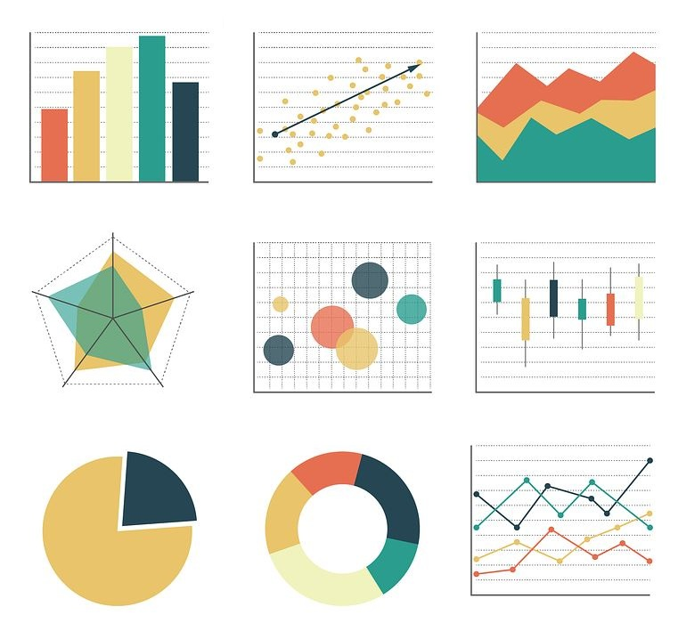
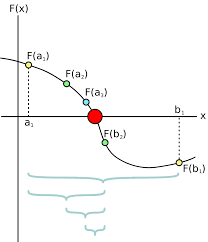

# CCP9040 Bibliotecas de Visualização de Dados

---

## Tipos de Gráficos
- Linhas
- Dispersão
- Barra
- Pizza
- Histograma
- Boxplot



---

## Conjunto de Dados Base (Pandas)

```python
import pandas as pd
import numpy as np

# Seed para reprodutibilidade dos dados aleatórios
np.random.seed(42)

# Criando o DataFrame
data = {
    'Mes': ['Jan', 'Fev', 'Mar', 'Abr', 'Mai', 'Jun', 'Jul', 'Ago', 'Set', 'Out', 'Nov', 'Dez'],
    'Vendas': np.random.randint(150, 300, 12),
    'Clientes': np.random.randint(20, 50, 12),
    'Custo_Operacional': np.random.randint(50, 150, 12),
    'Categoria_Produto': np.random.choice(['Eletrônicos', 'Vestuário', 'Casa', 'Alimentos'], 12)
}
df = pd.DataFrame(data)
df['Lucro'] = df['Vendas'] - df['Custo_Operacional']
df['Mes_Num'] = range(1, 13) # Para ordenação ou eixos numéricos
```

---

# Matplotlib

[https://matplotlib.org/](https://matplotlib.org/)

---

## Matplotlib - Gráfico de Linhas

```python
import matplotlib.pyplot as plt

plt.figure(figsize=(8, 5))
plt.plot(df['Mes'], df['Vendas'], marker='o', linestyle='-', color='b')
plt.title('Vendas Mensais (Matplotlib)')
plt.xlabel('Mês')
plt.ylabel('Vendas (R$)')
plt.xticks(rotation=45) # Melhor visualização dos meses
plt.grid(True)
# plt.savefig('images/matplotlib_line.png')
plt.show()
```

---

## Matplotlib - Gráfico de Dispersão

```python
import matplotlib.pyplot as plt
import pandas as pd

plt.figure(figsize=(8, 5))
plt.scatter(df['Clientes'], df['Vendas'], color='green', alpha=0.7)
plt.title('Relação Vendas vs. Clientes (Matplotlib)')
plt.xlabel('Número de Clientes')
plt.ylabel('Vendas (R$)')
plt.grid(True)
# plt.savefig('images/matplotlib_scatter.png')
plt.show()
```

---

## Matplotlib - Gráfico de Barra

```python
import matplotlib.pyplot as plt
import pandas as pd

plt.figure(figsize=(10, 6))
plt.bar(df['Mes'], df['Lucro'], color='skyblue')
plt.title('Lucro por Mês (Matplotlib)')
plt.xlabel('Mês')
plt.ylabel('Lucro (R$)')
plt.xticks(rotation=45)
# plt.savefig('images/matplotlib_bar.png')
plt.show()
```

---

## Matplotlib - Gráfico de Pizza

```python
import matplotlib.pyplot as plt
import pandas as pd

# Agregando vendas por categoria para o gráfico de pizza
vendas_por_categoria = df.groupby('Categoria_Produto')['Vendas'].sum()

plt.figure(figsize=(8, 8))
plt.pie(vendas_por_categoria, labels=vendas_por_categoria.index, 
        autopct='%1.1f%%', startangle=90, colors=plt.cm.Paired.colors)
plt.title('Distribuição de Vendas por Categoria de Produto (Matplotlib)')
plt.axis('equal')
# plt.savefig('images/matplotlib_pie.png')
plt.show()
```

---

## Matplotlib - Histograma

```python
import matplotlib.pyplot as plt
import pandas as pd

plt.figure(figsize=(8, 5))
plt.hist(df['Vendas'], bins=5, color='purple', edgecolor='black')
plt.title('Distribuição de Frequência das Vendas (Matplotlib)')
plt.xlabel('Valor da Venda (R$)')
plt.ylabel('Frequência')
# plt.savefig('images/matplotlib_histogram.png')
plt.show()
```

---

## Matplotlib - Boxplot

```python
import matplotlib.pyplot as plt
import pandas as pd

# Preparando dados para boxplot por categoria
# Criamos uma lista de arrays, onde cada array são as vendas de uma categoria
dados_boxplot = [df[df['Categoria_Produto'] == cat]['Vendas'] for cat in df['Categoria_Produto'].unique()]
categorias_unicas = df['Categoria_Produto'].unique()

plt.figure(figsize=(10, 6))
plt.boxplot(dados_boxplot, labels=categorias_unicas)
plt.title('Distribuição de Vendas por Categoria de Produto (Matplotlib)')
plt.ylabel('Vendas (R$)')
plt.xlabel('Categoria do Produto')
# plt.savefig('images/matplotlib_boxplot.png')
plt.show()
```

---

# Seaborn
[https://seaborn.pydata.org/](https://seaborn.pydata.org/)

---

## Seaborn - Gráfico de Linhas

```python
import seaborn as sns
import matplotlib.pyplot as plt
import pandas as pd

plt.figure(figsize=(8, 5))
sns.lineplot(x='Mes_Num', y='Vendas', data=df, marker='o', color='coral', 
             hue='Categoria_Produto', style='Categoria_Produto')
# Usando Mes_Num para ordenação correta se Mes for string e não estiver ordenado
plt.title('Vendas Mensais por Categoria (Seaborn)')
plt.xlabel('Mês (Número)')
plt.ylabel('Vendas (R$)')
plt.xticks(ticks=df['Mes_Num'], labels=df['Mes'], rotation=45) # Mostrar nomes dos meses
plt.grid(True)
# plt.savefig('images/seaborn_line.png')
plt.show()
```

---

## Seaborn - Gráfico de Dispersão

```python
import seaborn as sns
import matplotlib.pyplot as plt
import pandas as pd

plt.figure(figsize=(8, 5))
sns.scatterplot(x='Clientes', y='Vendas', data=df, hue='Categoria_Produto', 
                size='Lucro', palette='viridis', sizes=(50, 200))
plt.title('Relação Vendas vs. Clientes por Categoria (Seaborn)')
plt.xlabel('Número de Clientes')
plt.ylabel('Vendas (R$)')
plt.grid(True)
# plt.savefig('images/seaborn_scatter.png')
plt.show()
```

---

## Seaborn - Gráfico de Barra

```python
import seaborn as sns
import matplotlib.pyplot as plt
import pandas as pd

plt.figure(figsize=(10, 6))
# Seaborn barplot por padrão mostra a média se houver múltiplos valores por x
# Para somar, poderíamos agregar antes ou usar estimator=sum
sns.barplot(x='Mes', y='Vendas', data=df, hue='Categoria_Produto', 
            palette='muted', estimator=sum, errorbar=None)
plt.title('Total de Vendas por Mês e Categoria (Seaborn)')
plt.xlabel('Mês')
plt.ylabel('Total de Vendas (R$)')
plt.xticks(rotation=45)
plt.legend(title='Categoria')
# plt.savefig('images/seaborn_bar.png')
plt.show()
```

---

## Seaborn - Gráfico de Pizza
*Seaborn não tem uma função direta para gráfico de pizza. Geralmente, usa-se Matplotlib.*

```python
import matplotlib.pyplot as plt
import seaborn as sns # Para paleta de cores
import pandas as pd

vendas_por_categoria = df.groupby('Categoria_Produto')['Vendas'].sum()

plt.figure(figsize=(8, 8))
plt.pie(vendas_por_categoria, labels=vendas_por_categoria.index, autopct='%1.1f%%', 
        startangle=90, colors=sns.color_palette('pastel', len(vendas_por_categoria)))
plt.title('Distribuição de Vendas por Categoria (Pizza com Cores Seaborn)')
plt.axis('equal')
# plt.savefig('images/seaborn_pie_matplotlib.png')
plt.show()
```

---

## Seaborn - Histograma

```python
import seaborn as sns
import matplotlib.pyplot as plt
import pandas as pd

plt.figure(figsize=(8, 5))
sns.histplot(data=df, x='Lucro', kde=True, color='magenta',
             hue='Categoria_Produto', multiple="stack")
plt.title('Distribuição de Frequência do Lucro por Categoria (Seaborn)')
plt.xlabel('Lucro (R$)')
plt.ylabel('Frequência')
# plt.savefig('images/seaborn_histogram.png')
plt.show()
```

---

## Seaborn - Boxplot

```python
import seaborn as sns
import matplotlib.pyplot as plt
import pandas as pd

plt.figure(figsize=(10, 6))
sns.boxplot(x='Categoria_Produto', y='Vendas', data=df, palette='Set2')
plt.title('Distribuição de Vendas por Categoria de Produto (Seaborn)')
plt.xlabel('Categoria do Produto')
plt.ylabel('Vendas (R$)')
# plt.savefig('images/seaborn_boxplot.png')
plt.show()
```

---

# Plotly
[https://plotly.com/python/](https://plotly.com/python/)

---

## Plotly - Gráfico de Linhas

```python
import plotly.express as px
import pandas as pd
# import plotly.io as pio # Necessário para salvar imagens estáticas

fig = px.line(df, x='Mes', y='Vendas', color='Categoria_Produto', markers=True,
              title='Vendas Mensais por Categoria (Plotly)',
              labels={'Vendas': 'Vendas (R$)', 'Mes': 'Mês'})
# Garante a ordem correta dos meses
fig.update_xaxes(categoryorder='array', categoryarray=df['Mes'].unique()) 
# pio.write_image(fig, 'images/plotly_line.png')
fig.show()
```

---

## Plotly - Gráfico de Dispersão

```python
import plotly.express as px
import pandas as pd
# import plotly.io as pio

fig = px.scatter(df, x='Clientes', y='Vendas', color='Categoria_Produto', 
                size='Lucro', hover_data=['Mes'], 
                title='Relação Vendas vs. Clientes (Plotly)',
                labels={'Clientes': 'Número de Clientes', 'Vendas': 'Vendas (R$)'})
# pio.write_image(fig, 'images/plotly_scatter.png')
fig.show()
```

---

## Plotly - Gráfico de Barra

```python
import plotly.express as px
import pandas as pd
# import plotly.io as pio

# Agregando para Plotly Bar - se quisermos mostrar a soma por categoria/mês
df_grouped_bar = df.groupby(['Mes', 'Categoria_Produto'], as_index=False)['Vendas'].sum()
df_grouped_bar = df_grouped_bar.sort_values(by='Mes', 
                 key=lambda x: pd.Categorical(x, categories=df['Mes'].unique(), ordered=True))


fig = px.bar(df_grouped_bar, x='Mes', y='Vendas', 
             color='Categoria_Produto', barmode='group',
             title='Vendas por Mês e Categoria (Plotly)',
             labels={'Vendas': 'Vendas (R$)', 'Mes': 'Mês'})
# pio.write_image(fig, 'images/plotly_bar.png')
fig.show()
```

---

## Plotly - Gráfico de Pizza

```python
import plotly.express as px
import pandas as pd
# import plotly.io as pio

# Agregando vendas por categoria para o gráfico de pizza
vendas_por_categoria_plotly = df.groupby('Categoria_Produto', as_index=False)['Vendas'].sum()

fig = px.pie(vendas_por_categoria_plotly, names='Categoria_Produto', values='Vendas', 
             title='Distribuição de Vendas por Categoria de Produto (Plotly)')
# pio.write_image(fig, 'images/plotly_pie.png')
fig.show()
```

---

## Plotly - Histograma

```python
import plotly.express as px
import pandas as pd
# import plotly.io as pio

fig = px.histogram(df, x='Lucro', color='Categoria_Produto', marginal="rug", # ou "box", "violin"
                   barmode='overlay', # 'stack', 'group', 'overlay'
                   title='Distribuição de Lucro por Categoria (Plotly)',
                   labels={'Lucro': 'Lucro (R$)'})
fig.update_traces(opacity=0.75) # Para 'overlay'
# pio.write_image(fig, 'images/plotly_histogram.png')
fig.show()
```

---

## Plotly - Boxplot

```python
import plotly.express as px
import pandas as pd
# import plotly.io as pio

fig = px.box(df, x='Categoria_Produto', y='Vendas', color='Categoria_Produto',
             points="all", # 'outliers', False, 'all'
             title='Distribuição de Vendas por Categoria (Plotly)',
             labels={'Vendas': 'Vendas (R$)', 'Categoria_Produto': 'Categoria do Produto'})
# pio.write_image(fig, 'images/plotly_boxplot.png')
fig.show()
```

---

## Algoritmo da Bisseção

Comece com um intervalo, corte-o ao meio repetidamente, sempre mantendo a metade onde a função cruza o zero, até que o ponto do meio seja bom o suficiente ou o intervalo seja minúsculo.</p>
### O que você precisa:
- Sua equação $f(x) = 0$
- Dois chutes iniciais, $a$ e $b$, onde $f(a)$ e $f(b)$ tenham sinais diferentes.
- Uma "tolerância": quão perto de zero $f(x)$ precisa estar, ou quão pequeno o intervalo $[a,b]$ precisa ser.



---

## Aplicação: Bisseção e Visualização da Convergência (1/3)

**Objetivo:** Implementar o algoritmo da bisseção e visualizar sua convergência usando Seaborn e Plotly.

**Problema Base:**
Considere a função $f(x) = x^3 - x - 2$.
1.  **Intervalo Inicial:** Use $[a, b] = [1, 2]$. Verifique se $f(1) \cdot f(2) < 0$.
2.  **Critérios de Parada:** Defina uma tolerância (ex: `tolerancia = 1e-6`) e um número máximo de iterações (ex: `max_iteracoes = 100`).

---

## Aplicação: Bisseção e Visualização da Convergência (2/3)

**Tarefas:**

1.  **Implemente o Algoritmo da Bisseção em Python:**
    *   Crie uma função `bissecao(func, a, b, tol, max_iter)`.
    *   A função deve retornar:
        *   A raiz aproximada.
        *   Um histórico das iterações (sugestão: uma lista de dicionários ou um DataFrame Pandas). Cada registro do histórico deve conter, no mínimo:
            *   Número da iteração (`i`)
            *   Ponto médio (`m_i`)
            *   Valor da função no ponto médio (`f(m_i)`)
            *   Erro aproximado (ex: $|b_i - a_i|/2$ ou $|f(m_i)|$)

--- 

## Aplicação: Bisseção e Visualização da Convergência (3/3)

2.  **Visualize a Convergência com Seaborn:**
    *   A partir do histórico de iterações:
        *   Crie um gráfico de linhas mostrando como o erro aproximado (ex: $|f(m_i)|$) diminui a cada iteração.
        *   Opcional: Crie um gráfico mostrando como o valor de $m_i$ converge para a raiz.

3.  **Visualize a Convergência com Plotly:**
    *   Crie gráficos de linha interativos semelhantes aos do Seaborn.
    *   Configure os tooltips para exibir informações relevantes de cada iteração (ex: iteração, $m_i$, $f(m_i)$, erro).

**Dica:** A estrutura de dados que armazena o histórico de cada iteração é fundamental para criar as visualizações!

