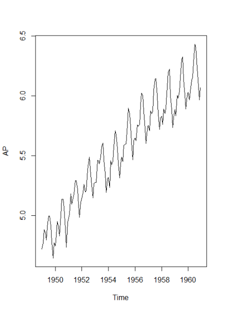
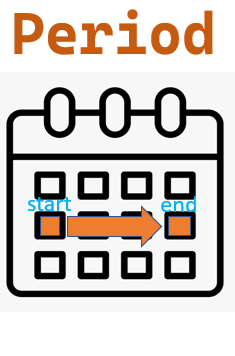

-----

marp: true
theme: uncover
class:

  - invert
    paginate: true
    header: 'Análise de Séries Temporais com Pandas'    

-----

# **Análise de Séries Temporais com Pandas**

### Um breve introdução


<div style="position:absolute; bottom: 20px; color: gray;">
<a href="https://pandas.pydata.org/docs/user_guide/timeseries.html" target="_blank">https://pandas.pydata.org/docs/user_guide/timeseries.html</a>
</div>

-----

## Agenda

**Parte 1: Fundamentos do Tempo no Pandas**

* O que são séries temporais e por que usar o Pandas.
* Estruturas de dados essenciais: `Timestamp`, `Period`, `DatetimeIndex`.

**Parte 2: Manipulação e Consulta de Dados**

* Técnicas de indexação, fatiamento, tratamento de fusos horários e reamostragem.

**Parte 3: Análise e Visualização para Insights**

* Visualização, decomposição de séries e análise de autocorrelação.

**Parte 4: Estudos de Caso Práticos**

* Aplicações em finanças, ciência ambiental e e-commerce.

-----

## **Parte 1**
## **Tempo no Pandas**


-----

### O que são Séries Temporais?

Dados de séries temporais são uma sequência de pontos de dados registrados em intervalos de tempo específicos. [1, 2]

  * São utilizados em finanças, economia, ciência ambiental, engenharia e muito mais.
  * A biblioteca **Pandas** oferece um kit de ferramentas para lidar com esses dados.



-----

### Objetos Temporais no Pandas

Imagine que você está planejando uma viagem:

*   **Timestamp:** É um ponto no tempo.
É o **momento exato** da sua partida.  15 de Outubro de 2023, às 08:00:00. 
*   **Period:** É um intervalo de tempo
É o **mês inteiro** da sua viagem. O mês de Outubro de 2023.
*   **Timedelta:** É uma quantidade de tempo.
É a **duração** da sua viagem.  7 dias e 3 horas. 
*   **DateOffset:** É uma **regra de calendário** para encontrar outra data. 
"A primeira segunda-feira depois da sua chegada"

---

### `Timestamp`: O Ponto Específico no Tempo

**Analogia:** O carimbo no passaporte ou o registro de ponto. Marca um instante único e preciso.

**O que é?**
Representa um único ponto no tempo, com precisão de nanossegundos. É a forma mais comum de representar datas em uma série temporal, como o índice de um DataFrame.


---

**Aplicação na Vida Real:**

*   **Vendas no E-commerce:** Cada venda ocorre em um `Timestamp` exato. Você precisa saber o segundo em que a compra foi efetuada para analisar picos de tráfego, eficácia de promoções-relâmpago, etc.
*   **Logs de Servidor:** Cada acesso, erro ou evento em um sistema é registrado com um `Timestamp`. Analistas de segurança e de sistemas usam isso para rastrear atividades.
*   **Mercado Financeiro:** O preço de uma ação é registrado em `Timestamps` para capturar a volatilidade do mercado em tempo real.

---

**Exemplo Prático em Pandas:**

```python
import pandas as pd

# Dados de vendas com o momento exato de cada transação
vendas = {
    'id_venda': [101, 102, 103],
    'momento_compra': ['2023-10-25 09:30:15', '2023-10-25 09:32:05', '2023-10-25 14:05:40']
}
df_vendas = pd.DataFrame(vendas)

# Convertendo a coluna para o tipo Timestamp do Pandas
df_vendas['momento_compra'] = pd.to_datetime(df_vendas['momento_compra'])

# Agora, a coluna é composta por objetos Timestamp
print(df_vendas.dtypes)

# Acessando o primeiro Timestamp
primeira_venda = df_vendas['momento_compra'].iloc[0]
print(f"A primeira venda ocorreu em: {primeira_venda}")
```

---

### `Period`: O Intervalo de Tempo

**Analogia:** A página de um calendário (o dia inteiro, o mês inteiro, o ano inteiro).

**O que é?**
Representa um intervalo ou um período de tempo, como um mês, um trimestre fiscal ou um ano inteiro. Ele não se importa com a hora ou o minuto, apenas com o intervalo que ele representa.



---

**Aplicação na Vida Real:**

*   **Relatórios Financeiros:** Empresas reportam resultados por **trimestres** (ex: Q3 2023) ou por **mês** (ex: Outubro de 2023). Você não diz "vendemos X até as 17h do último dia do trimestre", mas sim "vendemos X no trimestre".
*   **Dados Econômicos:** O IBGE divulga a inflação mensal (um `Period` de um mês) ou o PIB trimestral (um `Period` de um trimestre).
*   **Planejamento de Metas:** Definir metas de vendas para o "mês de Dezembro" ou para o "segundo semestre do ano".

---

**Exemplo Prático em Pandas:**
Usamos `Period` principalmente para agregar dados que estão em `Timestamp`.

```python
# Usando nosso DataFrame de vendas anterior
# Vamos agregar as vendas por hora

# Converter o índice para Periodo de Hora ('H')
df_vendas.set_index('momento_compra', inplace=True)
vendas_por_hora = df_vendas.to_period('H')

print(vendas_por_hora.index)

# Agora podemos contar quantas vendas ocorreram em cada período de uma hora
print(vendas_por_hora.groupby(vendas_por_hora.index).count())
```

---

### `Timedelta`: A Duração Exata

**Analogia:** A duração da viagem ou o tempo de um cronômetro.

**O que é?**
Representa a diferença entre dois `Timestamps`. É uma duração, uma quantidade de tempo (ex: 3 dias, 4 horas, 15 minutos).


---

**Aplicação na Vida Real:**

*   **Logística:** Calcular o **tempo de entrega** de um produto (data de entrega - data do pedido).
*   **Análise de Suporte ao Cliente:** Medir o **tempo de resolução** de um ticket de suporte (data de fechamento - data de abertura).
*   **Análise de Comportamento de Usuário:** Calcular a **duração da sessão** de um usuário em um site ou app (hora de logout - hora de login).

---

**Exemplo Prático em Pandas:**

```python
# DataFrame de logística
logistica = {
    'pedido_feito': ['2023-10-20 11:00:00', '2023-10-22 15:20:00'],
    'pedido_entregue': ['2023-10-23 14:30:00', '2023-10-25 18:00:00']
}
df_log = pd.DataFrame(logistica)
df_log['pedido_feito'] = pd.to_datetime(df_log['pedido_feito'])
df_log['pedido_entregue'] = pd.to_datetime(df_log['pedido_entregue'])

# Calculando a diferença entre dois Timestamps, o resultado é um Timedelta
df_log['tempo_entrega'] = df_log['pedido_entregue'] - df_log['pedido_feito']

print(df_log)

print(df_log.dtypes)
```

---

### 4. `DateOffset`: A Regra de Calendário Inteligente

**Analogia:** O lembrete inteligente no calendário ("próximo dia útil", "última sexta-feira do mês").

**O que é?**
É mais poderoso que um `Timedelta`. `DateOffset` representa uma regra de calendário. Ele entende conceitos como "dias úteis", "fim do mês", "início do trimestre", etc. Enquanto um `Timedelta` de "1 dia" é sempre 24 horas, um `DateOffset` de "1 dia útil" pode pular um fim de semana.


---

**Aplicação na Vida Real:**

*   **Finanças:** Calcular a data de vencimento de um boleto. 
"Vence em 5 dias úteis". Se hoje é quinta-feira, o vencimento será na próxima quinta, pulando sábado e domingo.
*   **Recursos Humanos:** 
Agendar o pagamento de salários para a "último dia útil do mês".
*   **Agendamento de Relatórios:** 
Gerar um relatório de performance todo "início de trimestre" (`QS-OCT`).

---

**Exemplo Prático em Pandas:**

```python
from pandas.tseries.offsets import BDay, BMonthEnd

hoje = pd.Timestamp('2023-10-26') # Uma quinta-feira

# Adicionando um Timedelta de 3 dias (sempre 72 horas)
vencimento_simples = hoje + pd.Timedelta(days=3)
# Cai no domingo
print(f"Vencimento com Timedelta: {vencimento_simples.date()}")

# Adicionando um DateOffset de 3 dias úteis (Business Days)
# Pula o fim de semana
vencimento_util = hoje + BDay(3)
print(f"Vencimento com DateOffset (dias úteis): {vencimento_util.date()}")

# Encontrando o último dia útil do mês atual
ultimo_dia_util_mes = hoje + BMonthEnd(0)
print(f"Data de pagamento (último dia útil): {ultimo_dia_util_mes.date()}")
```

---

| Conceito | O que é | Exemplo | Objeto no Pandas |
| :--- | :--- | :--- | :--- |
| **Timestamp** | Um ponto exato no tempo | Momento de uma venda, log de sistema | `pd.Timestamp` |
| **Period** | Um intervalo de tempo | Mês de faturamento, trimestre fiscal | `pd.Period` |
| **Timedelta**| Uma duração de tempo | Tempo de entrega, duração de uma chamada | `pd.Timedelta` |
| **DateOffset**| Uma regra de calendário | "3 dias úteis", "fim do mês" | `pd.tseries.offsets.*` |

-----

### A Espinha Dorsal: Objetos de Índice

A vantagem do Pandas para análise de séries temporais é a indexação temporal.

  * **`DatetimeIndex`**: Consiste em uma sequência de objetos `Timestamp`.
  * **`PeriodIndex`** e **`TimedeltaIndex`**: Sequências de objetos `Period` ou `Timedelta`.

**Atenção:**
O ato de definir uma coluna como o índice via `df.set_index()` é o que eleva um DataFrame padrão a um objeto de série temporal, habilitando funcionalidades como `.resample()` e `.rolling()`.


-----

### Ingestão e Parsing: Criando Séries Temporais

Antes da análise, os dados devem ser carregados e interpretados corretamente.

  * **`pd.to_datetime()`**: A função para converter vários formatos de data/hora. 

    ```python
    pd.to_datetime(['2024-01-01', '02/03/2024', '7/8/1952'])
    # Resolvendo ambiguidade (formato dia/mês)
    pd.to_datetime('7/8/1952', dayfirst=True)
    ```
  * **`pd.date_range()`**: Gera um `DatetimeIndex` com uma frequência específica. 

    ```python
    pd.date_range(start='2024-01-01', periods=5, freq='B') # 5 dias úteis
    ```

-----

## **Parte 2**
## **Manipulação e Consulta de Dados**


-----

### Estudo de Caso: Vendas Diárias da "Loja Pynina"

Vamos analisar as vendas diárias de uma loja fictícia.

```python
import pandas as pd
import numpy as np

# Criando nosso DataFrame de vendas diárias para 2024
datas = pd.date_range(start='2024-01-01', end='2024-03-31', freq='D')
np.random.seed(42) # Para resultados reproduzíveis
vendas_dados = np.random.randint(low=50, high=200, size=len(datas))

df_vendas = pd.DataFrame({'vendas': vendas_dados}, index=datas)
df_vendas.index.name = 'data'

print(df_vendas.head())
```

---

### **Pergunta 1:** Como foram as vendas na terceira semana de Janeiro?

Para responder, usamos a **indexação por string** e o **fatiamento (slicing)**, que são recursos do `DatetimeIndex`.

  * **Indexação por String Parcial**: Selecione por ano ou mês.
    ```python
    # Vendas de todo o mês de Janeiro de 2024
    vendas_janeiro = df_vendas['2024-01']
    ```
  * **Fatiamento de Intervalos**: Selecione um período específico.
    ```python
    # Vendas da terceira semana de Janeiro (dia 15 ao 21)
    # O limite final é inclusivo
    vendas_semana_3 = df_vendas['2024-01-15':'2024-01-21']
    print(vendas_semana_3)
    ```

-----

### **Pergunta 2:** Existe um padrão de vendas por dia da semana?

Para descobrir, precisamos extrair componentes da data. O acessor `.dt` (para colunas) ou o próprio `DatetimeIndex` nos dão acesso a atributos como ano, mês e dia da semana.

```python
# Adicionando uma coluna com o nome do dia da semana
df_vendas['dia_da_semana'] = df_vendas.index.day_name()

# Calculando a média de vendas para cada dia da semana
media_por_dia = df_vendas.groupby('dia_da_semana')['vendas']
                .mean().sort_values(ascending=False)

print(media_por_dia)
# dia_da_semana
# Tuesday      138.076923
# Saturday     129.615385
# ...
```

-----

### **Pergunta 3:** Qual foi o faturamento total em cada mês?

Nossos dados são diários, mas a pergunta é mensal. Precisamos mudar a frequência dos dados. Isso é **Resampling**.

*   **Downsampling**: Reduzir a frequência (ex: de diário para mensal). Requer uma função de agregação (`.sum()`, `.mean()`).

```python
# Agregando as vendas diárias para obter o total mensal
faturamento_mensal = df_vendas['vendas'].resample('M').sum()
# 'M' significa "Month End Frequency" (Fim do Mês)

print(faturamento_mensal)
```

-----

### **Pergunta 4:** Qual é a tendência de vendas, ignorando o ruído diário?

As vendas diárias variam muito. Para ver a tendência real, usamos uma **média móvel**, calculada com a função `.rolling()`.

*   **Janelas Deslizantes (`.rolling()`)**: Calcula uma estatística (como a média) sobre uma janela de tamanho fixo que "desliza" pela série.

```python
# Calculando a média móvel de 7 dias para suavizar o gráfico
df_vendas['media_movel_7d'] = df_vendas['vendas'].rolling(window=7).mean()

# Plotando para comparar (o código do plot foi omitido por simplicidade)
# df_vendas[['vendas', 'media_movel_7d']].plot(figsize=(12,6))
```


A linha azul (média móvel) mostra a tendência de forma muito mais clara que os dados brutos (laranja).

-----

### Um Desafio Real: Lidando com Fusos Horários

Imagine que os dados da "Loja Pynina" foram registrados num servidor em Londres (UTC), mas a loja opera em São Paulo.

  * **Naive vs. Aware**:
      * Um objeto **Naive** (ingênuo) não tem fuso horário. Nossos dados atuais são assim.
      * Um objeto **Aware** (ciente) sabe seu fuso horário e regras de horário de verão.

  * **O Fluxo de Trabalho Correto**:
    1.  **Localize primeiro (`.tz_localize`)**: Diga ao Pandas qual era o fuso horário original dos dados.
    2.  **Converta depois (`.tz_convert`)**: Converta para o fuso horário desejado.

-----

### Fusos Horários na Prática

```python
# 1. Nossos dados são 'naive'. Vamos dizer que foram registrados em UTC.
vendas_utc = df_vendas.tz_localize('UTC')
print(vendas_utc.head(1))
#                             vendas dia_da_semana  media_movel_7d
# data
# 2024-01-01 00:00:00+00:00     152       Tuesday             NaN

# 2. Agora que são 'aware', podemos converter para o fuso de São Paulo.
vendas_sp = vendas_utc.tz_convert('America/Sao_Paulo')
print(vendas_sp.head(1))
#                             vendas dia_da_semana  media_movel_7d
# data
# 2023-12-31 21:00:00-03:00     152       Tuesday             NaN

# Tentar .tz_convert() em dados 'naive' causa um erro!
```
**Atenção:** Observe como a data e hora mudaram para refletir a conversão correta.

-----

### Preparando para Previsão: Criando Features com `.shift()`

Para modelos de Machine Learning, uma feature comum é o valor do dia anterior. Chamamos isso de **lag**.

*   **.shift(n)**: Desloca os dados por `n` períodos. Essencial para criar features de "valor anterior".

```python
# Criando uma feature com as vendas do dia anterior (lag de 1 dia)
df_vendas['vendas_ontem'] = df_vendas['vendas'].shift(1)

print(df_vendas[['vendas', 'vendas_ontem']].head(3))
```
Esta simples operação é a base para transformar um problema de série temporal em um problema de aprendizado supervisionado.

-----

## **Parte 3: Análise e Visualização para Insights**

-----

### Visualizando Padrões Temporais

A visualização eficaz permite ver tendências, sazonalidade e anomalias que não são aparentes em números brutos.

  * **Gráficos de Linha**: A visualização fundamental para dados de séries temporais, fornecendo uma visão geral imediata do comportamento dos dados.
  * **Gráficos Sazonais (Box Plots)**: Para investigar a sazonalidade, use box plots agrupados por um período sazonal (ex: mês ou dia da semana). Isso mostra claramente as mudanças na mediana, variância e outliers entre os períodos.
  * **Heatmaps**: Poderosos para visualizar a interação entre duas unidades baseadas no tempo (ex: mês vs. ano). Revelam padrões complexos, como se as tendências de vendas de fim de semana diferem no verão versus no inverno.

-----

### Análise de Decomposição

A decomposição fornece uma maneira estruturada de pensar sobre uma série temporal, dividindo-a em seus componentes. O modelo clássico assume que uma série temporal `(Y)` pode ser decomposta em:

  * **Tendência (T)**: A direção de longo prazo da série.
  * **Sazonalidade (S)**: Um padrão periódico e repetitivo.
  * **Resíduo (R)**: O ruído irregular e aleatório que resta.

Isso pode ser modelado como aditivo (`Y = T + S + R`) ou multiplicativo (`Y = T * S * R`).

A biblioteca `statsmodels` fornece uma implementação direta com `seasonal_decompose`.

-----

### Correlação no Tempo: ACF e PACF

Para quantificar as dependências temporais dentro de uma série, usamos gráficos de autocorrelação.

  * **Função de Autocorrelação (ACF)**: Mede a correlação de uma série temporal com uma versão defasada de si mesma. Um pico significativo no lag `k` significa que o valor no tempo `t` está fortemente correlacionado com o valor no tempo `t-k`.
  * **Função de Autocorrelação Parcial (PACF)**: Mede a correlação entre uma série temporal e seu lag, mas *após* remover os efeitos lineares dos lags intervenientes mais curtos.

Esses gráficos são ferramentas de diagnóstico prescritivas, formando a ponte crítica entre a exploração de uma série temporal e a especificação de um modelo de previsão estatística adequado, como o ARIMA.

-----

## **Parte 4: Aplicações no Mundo Real (Estudos de Caso)**

-----

### Estudo de Caso 1: Análise de Mercado Financeiro

  * **Objetivo**: Analisar os movimentos diários de preços de uma ação de tecnologia para identificar tendências de longo prazo usando médias móveis e quantificar a volatilidade de curto prazo.
  * **Dataset**: Preços diários históricos de uma ação da NASDAQ (ex: do Kaggle).
  * **Análise**:
    1.  **Carregar e Preparar Dados**: `read_csv`, `parse_dates`, `set_index`.
    2.  **Análise de Tendência com Médias Móveis**: Calcular e plotar as médias móveis de 50 e 200 dias do preço de fechamento.
    3.  **Análise de Volatilidade**: Calcular o desvio padrão dos retornos percentuais diários, reamostrados para uma frequência mensal.

-----

### Estudo de Caso 2: Ciência Ambiental e Mudanças Climáticas

  * **Objetivo**: Analisar dados históricos de temperatura diária de uma estação meteorológica para identificar e visualizar a tendência de aquecimento de longo prazo.
  * **Dataset**: NOAA Global Historical Climatology Network (GHCN-D).
  * **Análise**:
    1.  **Carregar e Preparar Dados**: Lidar com unidades (ex: décimos de grau Celsius) e valores ausentes.
    2.  **Agregar para Análise de Tendência**: Reamostrar os dados diários para médias anuais usando `.resample()`.
    3.  **Calcular e Visualizar Anomalias de Temperatura**: Plotar o desvio da temperatura de uma linha de base histórica (ex: 1951-1980) para destacar a tendência subjacente.

-----

### Estudo de Caso 3: Análise de Vendas de E-commerce

  * **Objetivo**: Analisar dados transacionais de e-commerce para descobrir padrões de vendas semanais e mensais, fornecendo insights acionáveis.
  * **Dataset**: Um dataset transacional como o "Online Retail" do Kaggle.
  * **Análise**:
    1.  **Carregar e Preparar Dados**: Limpar dados, calcular o total de vendas por transação e definir o `InvoiceDate` como índice.
    2.  **Agregar para Vendas Diárias**: Reamostrar os dados transacionais para uma frequência diária regular.
    3.  **Visualizar Padrões Semanais e Mensais**: Usar box plots para comparar as distribuições de vendas entre diferentes dias da semana ou meses.
    4.  **Criar um Heatmap de Vendas**: Visualizar a intensidade das vendas em duas dimensões de tempo, como mês e ano.

-----

### Conclusão

  * **Pandas é Indispensável**: Oferece um framework robusto e de alta performance para análise de séries temporais.
  * **Estruturas de Dados são a Chave**: O `DatetimeIndex` transforma um DataFrame padrão em um potente motor analítico.
  * **Entendimento Conceitual é Crucial**: Dominar a distinção entre `Timestamp` e `Period`, o fluxo de trabalho de fuso horário (`localize` -\> `convert`), e a natureza interpretativa do `resample` é fundamental.
  * **Fluxo de Trabalho Sistemático**: A análise de séries temporais permite passar sistematicamente da ingestão de dados brutos à descoberta de padrões profundos e à engenharia de features para modelagem preditiva.
  * **Versatilidade**: As mesmas funcionalidades do Pandas podem ser aplicadas a diversos domínios para extrair insights acionáveis e baseados em dados.

-----

<!-- _backgroundColor: yellow -->
# Perguntas?


-----

## Referências

https://pandas.pydata.org/docs/user_guide/timeseries.html
https://fastercapital.com/topics/applications-of-time-series-analysis.html/1
https://pandas.pydata.org/docs/user_guide/timeseries.html
https://www.dataquest.io/blog/tutorial-time-series-analysis-with-pandas/
https://www.geeksforgeeks.org/python/python-pandas-dataframe-resample/
https://pandas.pydata.org/docs/user_guide/indexing.html
https://datacarpentry.github.io/python-ecology-lesson/03-index-slice-subset.html
https://pandas.pydata.org/docs/reference/api/pandas.DatetimeIndex.html
https://pvlib-python.readthedocs.io/en/v0.3.1/timetimezones.html

-----

https://pandas.pydata.org/docs/reference/api/pandas.Series.tz_localize.html
https://towardsdatascience.com/resample-function-of-pandas-79b17ec82a78
https://www.datacamp.com/tutorial/pandas-resample-asfreq
https://www.geeksforgeeks.org/python/python-pandas-dataframe-resample/
https://pandas.pydata.org/docs/user_guide/window.html
https://llego.dev/posts/pandas-rolling-expanding-transformations/
https://llego.dev/posts/pandas-resampling-shifting-lagging-data-python/
https://docs.kanaries.net/topics/Pandas/pandas-shift
https://www.sparkcodehub.com/pandas/data-analysis/shift-data
https://python-graph-gallery.com/timeseries/
https://www.kaggle.com/code/youssef19/time-series-data-visualization-in-python
https://python-graph-gallery.com/heatmap-for-timeseries-matplotlib/
https://www.codecademy.com/article/visualizing-time-series-data-with-python

------

https://machinelearningmastery.com/decompose-time-series-data-trend-seasonality/
https://www.numberanalytics.com/blog/master-time-series-env-econ-swift-primer
https://gist.github.com/balzer82/5cec6ad7adc1b550e7ee
https://www.geeksforgeeks.org/how-to-calculate-autocorrelation-in-python/
https://www.kaggle.com/datasets/jacksoncrow/stock-market-dataset
https://docs.dominodatalab.com/en/cloud/user_guide/0927f7/understand-the-data/
https://projectpythia.org/dask-cookbook/notebooks/02-dask-dataframe.html
https://www.kaggle.com/code/amirmotefaker/predicting-sales-e-commerce
https://www.kaggle.com/code/allunia/e-commerce-sales-forecast